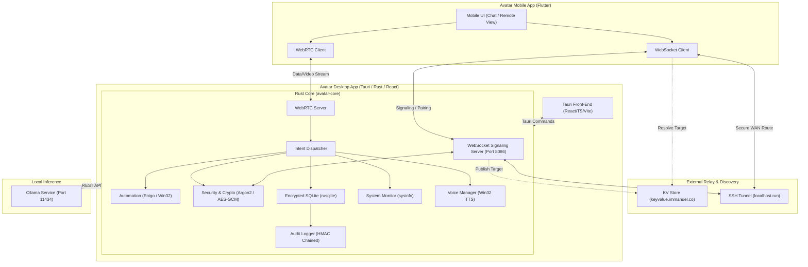
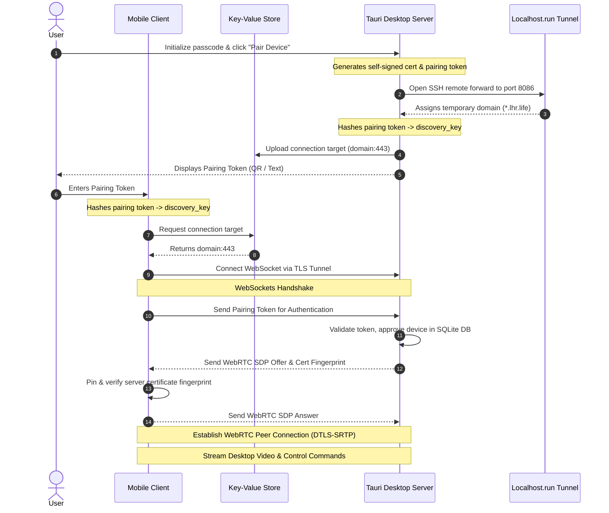
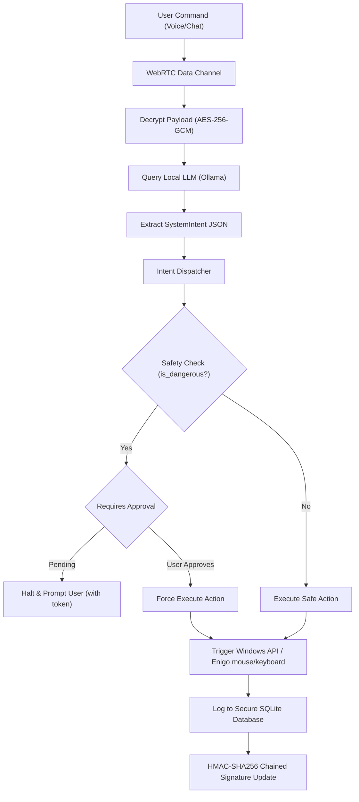

# Avatar Private Desktop Ecosystem

Avatar is a private, secure, and self-hosted personal desktop AI assistant ecosystem. It allows users to monitor, automate, and remote-control their Windows host machines directly from a cross-platform mobile application. To guarantee absolute user privacy, all AI model inference, database storage, and cryptographic operations run locally on the user's desktop hardware without reliance on external cloud servers.

---

## 🗺️ Architectural Overview

The ecosystem is built using a zero-trust model consisting of four main pillars:
1. **Avatar Core (`avatar-core`)**: A shared Rust library compiling system telemetry, WebRTC frame/data streaming, local AI client wrappers, secure audit log chains, database encryption, and OS automation control.
2. **Avatar Desktop (`avatar-desktop`)**: A Tauri v2 desktop host container running React, TypeScript, and Vite on the front-end, binding custom Tauri commands to the native Rust backend.
3. **Avatar Mobile (`avatar-mobile`)**: A Flutter client allowing secure pairing, real-time metrics visualizers, conversational AI interfaces, and WebRTC remote view controls.
4. **Local LLM Orchestrator (Ollama)**: A local inference engine running LLMs (such as Llama 3) to execute natural language intent extraction and queries.



---

## 🛠️ Technologies & Libraries

### 🦀 1. Core Backend: Rust (`avatar-core`)
*   **Database & Encryption**:
    *   `rusqlite`: SQLite database engine wrapper.
    *   `argon2`: Argon2id key-derivation for passcode verification and secure key storage.
    *   `aes-gcm`: AES-256-GCM authenticated row-level/column-level encryption.
*   **Networking & Signaling**:
    *   `webrtc`: WebRTC stack for screen/camera frame grabbing, RTP packetization, and DTLS-SRTP data channels.
    *   `tokio-tungstenite`: Asynchronous WebSockets signaling channel.
    *   `rustls` / `tokio-rustls`: Self-signed client/server certificate generation and verification.
*   **Telemetry & OS Automation**:
    *   `sysinfo`: Retrieves resource utilization logs (CPU, RAM, Disks, Network).
    *   `enigo`: Keyboard/mouse input synthesis.
    *   `windows` (Win32 bindings): Direct API manipulation for brightness, volume, locks, and anti-debugger detections (`IsDebuggerPresent`).
*   **Inference & Web utilities**:
    *   `reqwest`: Handles HTTP communications with local Ollama APIs and discovery KV stores.
    *   `serde` & `serde_json`: Object serialization.
    *   `jpeg-encoder`: Compresses screen/camera frames into high-speed JPEG format.

### 💻 2. Desktop Interface: Tauri, React, TS (`avatar-desktop`)
*   **Tauri v2**: Bridge linking HTML5 frontend frameworks directly to Rust native modules.
*   **React 18**: UI modularity and layout.
*   **Vite**: Next-generation bundler for near-instantaneous live reloads.
*   **Tailwind CSS**: Modern CSS component design.
*   **TypeScript**: Type-safety across state structures.

### 📱 3. Mobile Client: Flutter & Dart (`avatar-mobile`)
*   **Flutter SDK**: High-performance rendering engine compiling to native mobile targets.
*   **flutter_webrtc**: Direct integration with hardware decoders and WebRTC streaming buffers.
*   **web_socket_channel**: Stream-based websocket management.
*   **qr_code_scanner**: Visual reading of server pairing tokens.
*   **cryptography**: Dart library implementing AES-GCM and SHA-256 for secure client-side storage.

---

## 🔐 Security Architecture

Avatar implements a zero-trust network policy with several cryptographic guards:

| Vector | Feature | Implementation Details |
| :--- | :--- | :--- |
| **MITM Protection** | **mTLS 1.3 + WebRTC DTLS-SRTP** | Self-signed certificate fingerprints are exchanged and pinned during the visual QR pairing phase. Eavesdroppers cannot read signaling frames or video buffers. |
| **Replay Attacks** | **Challenge-Response Tokens** | WebSocket control packets require dynamic session tokens; WebRTC Data Channels use sequential, indexed commands that expire after a set time frame. |
| **Vault Access** | **RAM-only Session Keys** | Sensitive data columns (chat transcripts, telemetry cache, facts) are encrypted with AES-256-GCM. The encryption key is derived dynamically from user PIN via Argon2id and never saved to disk. |
| **Log Integrity** | **HMAC-SHA256 Chaining** | Every log event signature is chained: `HMAC(timestamp + type + desc + prev_signature)`. Any deletion or manual SQLite modification breaks the chain and flags a boot-up warning. |
| **Debugger Defenses** | **Win32 API Diagnostics** | The core routinely queries Windows kernel debugger flags. Detecting a debugger halts memory exposures and records a secure warning event. |

---

## 🔄 Technical Workflows

### 1. Secure Device Pairing

This sequence details how a mobile client discovers and establishes a secure, encrypted tunnel with the desktop host, even behind firewalls or CGNAT.



### 2. Intelligent Command Execution

How raw speech or text commands are verified, checked for safety permissions, and executed natively on the host system.



---

## ⚡ Setup & Installation

### Prerequisites

*   **Operating System**: Windows 10/11 (required for Win32 API and system automation bindings).
*   **Rustup & Cargo**: [Install Rustup](https://rustup.rs/) (edition 2021 target).
*   **Node.js**: [Install Node.js (v18+)](https://nodejs.org/).
*   **Flutter**: [Install Flutter SDK (v3.0+)](https://docs.flutter.dev/get-started/install/windows). Ensure `flutter doctor` passes.
*   **C++ Build Tools**: Visual Studio MSVC Build Tools with Windows SDK installed.
*   **Ollama**: [Download & install Ollama](https://ollama.com).

---

### Step 1: Set Up Local Inference (Ollama)

Avatar runs entirely on local models. Download and pull the default model configuration:

```bash
# Start Ollama service on http://127.0.0.1:11434
# Then, pull the model used by the system prompt
ollama pull llama3
```

*(Optional: You can also pull other models such as `qwen`, `gemma`, or `phi` if you wish to swap configuration profiles).*

---

### Step 2: Compile & Run the Tauri Desktop Server

1. Open your terminal and navigate to the desktop app project:
   ```bash
   cd avatar-desktop
   ```
2. Install package dependencies:
   ```bash
   npm install
   ```
3. Run the development build (spawns Tauri container instantly):
   ```bash
   npm run tauri dev
   ```
4. Build the production release binary:
   ```bash
   npm run tauri build
   ```
   *The executable `.msi`/`.exe` bundle will be created inside `avatar-desktop/src-tauri/target/release/bundle/`.*

---

### Step 3: Compile & Run the Mobile Client

1. Open a new terminal session and navigate to the mobile folder:
   ```bash
   cd avatar-mobile
   ```
2. Fetch package dependencies:
   ```bash
   flutter pub get
   ```
3. Compile and run on a connected emulator or physical device (connected via USB debug mode):
   ```bash
   flutter run
   ```
4. Build the release APK / IPA package bundles:
   ```bash
   # Build Android APK
   flutter build apk --release

   # Build iOS IPA (Requires macOS development host)
   flutter build ipa --release
   ```

---

## 🚀 Running the System

### 1. First Boot Setup
1. Start the **Ollama** service.
2. Launch the **Avatar Desktop Application**.
3. Set your secure Master PIN/Passcode to initialize the SQLite database vault.
4. Keep the application open. The application immediately boots up the WebSocket signaling server on port `8086` and spawns the background thread establishing the secure `localhost.run` SSH tunnel to obtain a `.lhr.life` WAN forwarding address.

### 2. Device Pairing
1. On the desktop interface, click the **PAIR NEW DEVICE** button in the Security column on the right side of the screen.
2. A dialogue modal will display the QR code and manual connection parameters.
3. Open the **Avatar Mobile Client** on your smartphone.
4. Pass the passcode initializer, tap the scanner icon, and capture the desktop QR code (or type in the text parameters manually).
5. Click **ESTABLISH SECURE LINK** on your phone.
6. The client maps the pairing key, retrieves the tunnel endpoint, establishes WebSockets over TLS, exchanges self-signed certificates (pinning fingerprints), and opens a direct WebRTC peer connection.

### 3. Remote Control & Speech
*   **Conversational Chat**: Send prompts to the desktop from the chat page on the mobile app. Ollama interprets your commands.
*   **Remote Stream**: View the active screen stream and manipulate host systems using mouse drag-and-clicks, keyboard shortcuts, or native voice speaking.
*   **Diagnostics Logs**: Inspect generated debug data in the desktop execution root:
    *   `desktop_stdout.log` / `desktop_stderr.log`: Active standard outputs.
    *   `debug_pairing.log`: Connection logs mapping pairing steps.
